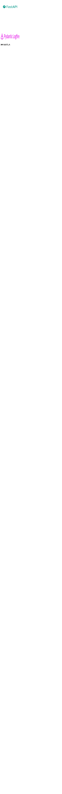

# pawamoy's website

My personal blog and website, built with [MkDocs](https://mkdocs.org),
and the [Material for MkDocs theme](https://squidfunk.github.io/mkdocs-material/).

Served at https://pawamoy.github.io/.

## Setup

Install dependencies in a venv with `/scripts/setup.sh`.

## Development

Serve locally with `./scripts/serve.sh`.

## Deployment

Deploy to [pawamoy.github.io](https://github.com/pawamoy/pawamoy.github.io)'s
GitHub pages with `./scripts/deploy.sh`.

---

Markdown, absolute URL:

---

Markdown, relative URL:

---

HTML, absolute URL:

---

HTML, relative URL:

