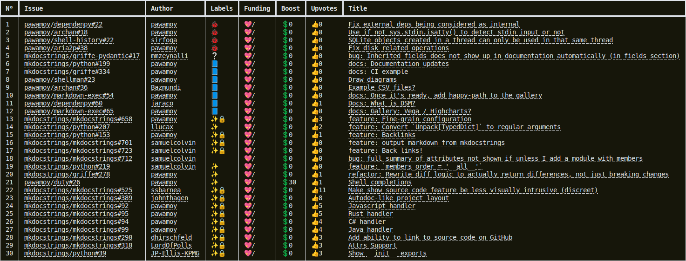

---
hide:
- navigation
---

# Backlog management

This page describes how I manage my backlog of issues on GitHub. This information is useful for both regular users and sponsors, since you'll learn how to give more weight to the issues you're interested in.

## Issue overview

I maintain many different projects on GitHub, each having its own issue tracker. GitHub provides an [/issues page](https://github.com/issues) which lets you fetch all issues across your user account and your organization accounts, for example with the query `is:open is:issue user:pawamoy org:mkdocstrings`. It then shows all found issues with pagination of (I believe) 30 items per page, which is more than enough to start working on issues. You can sort by upvotes to prioritize the issues that the most users are interested in. The final query can look like this: `is:open is:issue user:pawamoy org:mkdocstrings sort:reactions-+1-desc is:public`.

Unfortunately, there are a few limitations with this system.

- On GitHub you can upvote your own issues, giving you an unfair advantage over those who don't.
- Sponsors upvotes should have more weight according to their sponsorship amount (per month). This kind of sorting is not possible through GitHub webpages.
- Some kind of issues should always be prioritized over other kinds, for example bugs over features. Once again, you cannot sort based on labels on GitHub webpages.

To overcome these limitations, I developed a tool that lets me fetch issues from GitHub, as well as sponsorship data from platforms I support ([GitHub Sponsors] and [Polar] currently), that I can then sort according to my own, tailored criteria. It works in the terminal and displays a table of issues.

The columns show:

- the index of the issue in the backlog
- the issue identifier (account/repository#number)
- the author of the issue
- the labels (as emojis)
- the funding amount (more on this below, hidden here for privacy reasons)
- the number of upvotes
- the title of the issue

## Sponsorship amount

The sponsorship amount (or funding amount) is the sum of all distinct sponsorships attached to the author and upvoters of the issue. Lets unpack this.

On GitHub, you can sponsor using an organization account. Since it's not possible to add organizations as members of teams (my current way of giving access to private projects to sponsors), I ask organization sponsors to provide a list of usernames that should be granted access to private projects. These usernames are listed as members of this organization in my local configuration data.

Since their organization is sponsoring me, they must benefit from the voting power matching the organization sponsorship amount. The sponsorship and the users are therefore "linked" together. That lets me know, for a given user, which sponsorships they benefit from. A single user could benefit from multiple sponsorships, as they could create one themselves, and be a member of several organization that created sponsorships.

For a given issue, I therefore build the set of distinct sponsorships (literally using a Python `set`) from the issue author's linked sponsorships, and each of the issue upvoters' linked sponsorships. We give upvoters the same weight opportunity as the author, because a sponsor won't always be able to *create* the issues, and instead only be able to *upvote* them to show their interest.

**Sponsors, use your voting power!** :smile:

TIP: **List your organization members publicly, if possible.**
By having your organization members visible through GitHub's API, you enable automatic voting power matching your sponsorship amount for all your organization members.

## Sorting criteria

As of writing, here is the list of criteria used to sort the backlog, applied in order:

1. **Issues labeled as `top-priority` (🚨).** Super urgent issues, whether they are bugs or something else.
2. **Issues labeled as `bug` (🐞).** Bugs are given the highest priority. I don't think I need to elaborate why.
3. **Issues labeled as `unconfirmed` (❔).** It's important to triage issues quickly to identify bugs and documentation issues.
4. **Issues with a minimum total sponsorship amount of 50 (💖).** Issue priorization is a benefit of sponsorship tiers starting at $50 per month. Sponsors with lower tiers will have to combine their effort to reach 50 together. Both the author and the upvoters' sponsorships are taken into account, see [Sponsorship amount](#sponsorship-amount).
6. **Issues labeled as `docs` (📘).** Incorrect documentation is worse than no documentation.
7. **Issues labeled as `refactor` (🔨).** To reduce technical debt as early as possible.
8. **Sponsored issues** These issues are not prioritized over `docs` and `refactor`-labeled issues, but still get a small boost over other features.
9. **Issues with a minimum of 2 upvotes (👍).** Since one can upvote their own issue, we raise the bar to 2 upvotes.
10. **Issues labeled as `insiders` (🔒).** These issues are candidate for [Insiders](insiders.md) features (✨=feature). Insiders is generally what gives incentive to users to sponsor me, so it's only natural that I prioritize these features. Non-insiders features come after Insiders ones.
11. **Issues from the @mkdocstrings namespace.** Most of my sponsors are mainly interested in my work within mkdocstrings and its ecosystem, so I prioritize these over issues within my own namespace (@pawamoy).
12. **Oldest issues first.** First in, first out. It's ticketing system after all.

Although I generally follow this ordering, **I reserve the right to diverge from it**. This goes both ways. An issue with 0 funding and 0 upvotes could become top-priority if it will facilitate maintenance or prevent regressions. A bug I noticed could be skipped if nobody experiences it or if it happens in an old, unused project. A docs-related issue could be skipped if it's about adding (not fixing) non-critical information.

## Privacy

Since sponsors on [GitHub Sponsors] can create **private** sponsorships, there is a privacy concern with sharing the actual backlog, as it would indicate that users are sponsoring me, and for how much. **It means that I cannot share the real backlog publicly.** The backlog samples I share are always built **using public data only**, which means you shouldn't rely on them.

[GitHub Sponsors]: https://github.com/sponsors/
[Polar]: https://polar.sh
