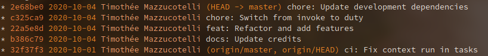
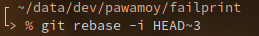
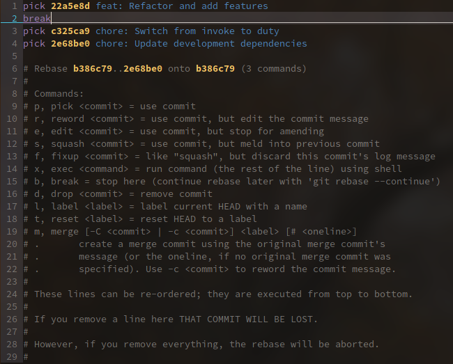
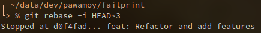
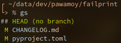
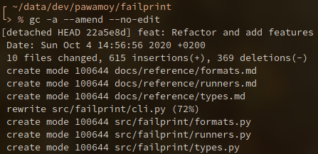
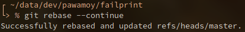

When you type `change git commit` or similar keywords in a search engine, you find many answers explaning how to rewrite a commit *message*, but not how to actually modify the *contents* of the commit.

This post quickly explains how to do that.

<!--more-->

Lets begin by listing our commits:



<small>
In this screenshot I use my `gl` alias which expands to:

```bash
git log --pretty=format:'%C(yellow)%h %Cgreen%ad %Cblue%an%Cgreen%d %Creset%s' --date=short --graph
```

</small>

Here I want to modify the contents of the third commit, `feat: Refactor and add features`, because I mistakenly committed modifications to the changelog which I didn't want.

So I run an interactive git rebase down to this commit by running:

```bash
git rebase -i HEAD~3
```



This command launches your git editor (vim here) to tell git what to do. Here we tell git to stop right after the commit we want to modify:



We save and quit this temporary file (with `:wq`), and git tells us that it stopped at the desired commit:



<small>
Don't pay attention to the commit SHA:
I took the screenshot afterwards so they don't match :smile:
</small>

Now you can start modifying, adding or deleting files!

In my case I wanted to remove wrong sections in `CHANGELOG.md`, as well as remove conflict-resolution lines in `pyproject.toml`.



<small>
In this screenshot I use my `gs` alias
which expands to `git status -sb`.
</small> 

All you have to do now is to amend the current commit (the one at which we stopped, the one we wanted to modify):

```bash
git commit -a --amend --no-edit
# --no-edit because we don't want to edit the message
```



And finally, let git finish the interactive rebase:

```bash
git rebase --continue
```



Done!
