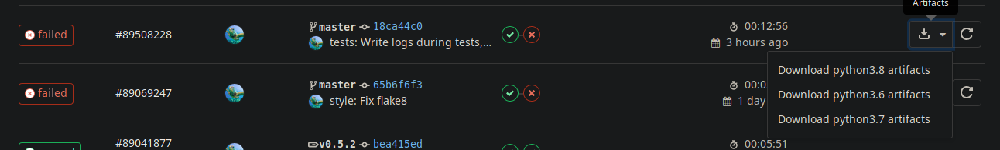
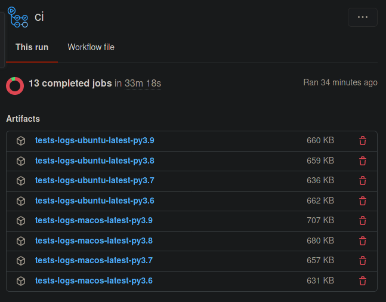

While I was writing tests for one of my latest project, [`aria2p`](https://github.com/pawamoy/aria2p), I noticed that some tests that were passing on my local machine were now failing on the GitLab CI runner.

I decided I needed to write all exceptions to log files so I could inspect what happened on GitLab.

<!--more-->

Since these tests were for the interactive interface of `aria2p`, using [`asciimatics`](https://github.com/peterbrittain/asciimatics) and therefore an alternate buffer, I could not add `print` statements in the code to generate useful debug information that would be printed in the GitLab job logs.

But I was already logging every exception! I just had to enable the logging functionality while running tests, and write them to the disk so I could create an artifact! The artifact could then be downloaded, and inspected in great details to see exactly what happened.

What I use:

- [`loguru`](https://github.com/Delgan/loguru) as a logging utility. It's really easy to use, and I have to admit that I just like the colors :wink:
- [`pytest`](https://github.com/pytest-dev/pytest/) to run the test suite. It's very powerful and has lots of nice plugins, like [`pytest-cov`](https://github.com/pytest-dev/pytest-cov), [`pytest-sugar`](http://pivotfinland.com/pytest-sugar/) and [`pytest-xdist`](https://github.com/pytest-dev/pytest-xdist).
- [GitLab CI](https://docs.gitlab.com/ee/ci/) as Continuous Integration service.

## Logging with loguru

Let say you have an interactive function that accepts user input and execute code according to this input. Anything could happen, right? So you log every exception that might happen like this:

```python
from loguru import logger


def run():
    try:
        ...  # actual code
    except Exception as error:
        logger.exception(error)
```

## Testing the code

Now in `pytest`, you would write a test function:

```python
from my_package import run


def test_run():
    interface = run()
    # verify things afterwards
    assert interface.state == 1
```

This code is not really important. What we're interested in is how we will write the logs of each test function into its own file on the disk.

## Writing logs for each test

`pytest` allows you to run code before each test using fixtures. It's a bit more powerful than that (check the docs), but this is how we use it in this post.

In your `tests/` directory, add a `conftest.py` file that `pytest` will automatically use.

Our fixture is written like this:

```python
from pathlib import Path
from loguru import logger
import pytest


@pytest.fixture(autouse=True)
def write_logs(request):
    # put logs in tests/logs
    log_path = Path("tests") / "logs"

    # tidy logs in subdirectories based on test module and class names
    module = request.module
    class_ = request.cls
    name = request.node.name + ".log"

    if module:
        log_path /= module.__name__.replace("tests.", "")
    if class_:
        log_path /= class_.__name__

    log_path.mkdir(parents=True, exist_ok=True)

    # append last part of the name
    log_path /= name

    # enable the logger
    logger.remove()
    logger.configure(handlers=[{"sink": log_path, "level": "TRACE", "mode": "w"}])
    logger.enable("my_package")
```

Let's explain this code in details.

- `@pytest.fixture(autouse=True)`: this decorator tells to always run the declared function before a test.
- `def write_logs(request):`: the `request` parameter actually tells `pytest` to use its built-in `request` fixture! It allows to inspect the context of the current test function, the one that "requested" this fixture. We will retrieve the module, class and function name from the `request` object.
- `log_path = Path("tests") / "logs"`: `loguru` accepts File-like objects, isn't it nice? We will write our tests in the subdirectory "tests/logs".
- then we simply build the file path using the module name if it exists, the class name if it exists, and create the parents directory, ignoring errors if they already exists.
- `logger.remove()`: `loguru` starts with a default handler. We remove it before adding our own.
- we set our handler using the `log_path` variable, the `TRACE` level (the lowest level to catch everything), and the mode `"w"`. The default mode is `"a"`, for append, but we want don't want to keep the logs of previous runs, so we overwrite them each time.
- finally, enable the logger for your package.

We're set up.

With this tests structure:

```
tests/
├── test_cli.py
│  ├── def test_a
│  └── def test_b
└── test_interface.py
    ├── class TestFirstClass
    │  ├── def test_a
    │  └── def test_b
    └── class TestSecondClass
    │  ├── def test_a
    │  └── def test_b
    └── def test_c
```

You will have this logs tree:

```

tests/
└── logs/
    ├── test_cli/
    │  ├── test_a.log
    │  └── test_b.log
    └── test_interface/
        ├── TestFirstClass/
        │  ├── test_a.log
        │  └── test_b.log
        └── TestSecondClass/
        │  ├── test_a.log
        │  └── test_b.log
        └── test_c.log
```

OK great! Now let's configure GitLab CI to use this directory as an artifact.

## Logs artifact on GitLab CI

You'll typically want to download the logs when a job failed.

Add this in your test job:

```yaml
artifacts:
  paths:
    - tests/logs
  when: on_failure
  expire_in: 1 week
```

Now when a job fails, you'll be able to download or browse the logs:


Or even from the pipelines pages:



## Logs artifact in GitHub Workflow

Same thing, but for a GitHub workflow:

```yaml
jobs:

  tests:

    strategy:
      fail-fast: false
      matrix:
        os: [ubuntu-latest, macos-latest, windows-latest]
        python-version: [3.6, 3.7, 3.8, 3.9]

    runs-on: ${{ matrix.os }}

    # setup steps, etc.

    - name: Run the test suite
      run: poetry run duty test  # or your actual test command

    - name: Archive tests logs
      uses: actions/upload-artifact@v2
      if: ${{ failure() }}
      with:
        name: tests-logs-${{ matrix.os }}-py${{ matrix.python-version }}
        path: |
          tests/logs
        retention-days: 7
```

You'll be able to download the artifacts from the workflow page:


