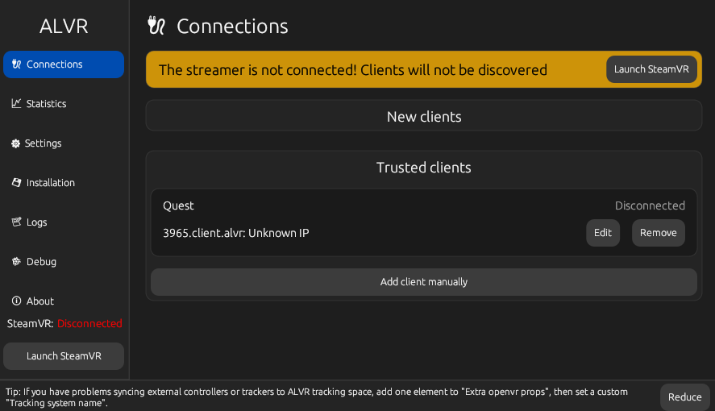
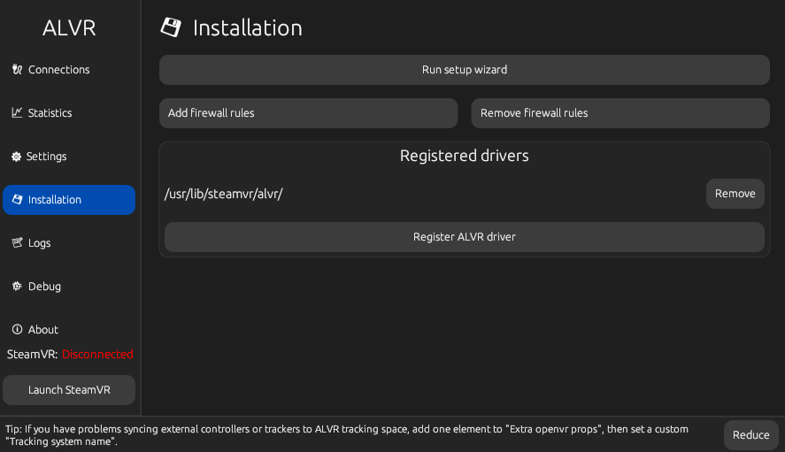
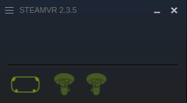
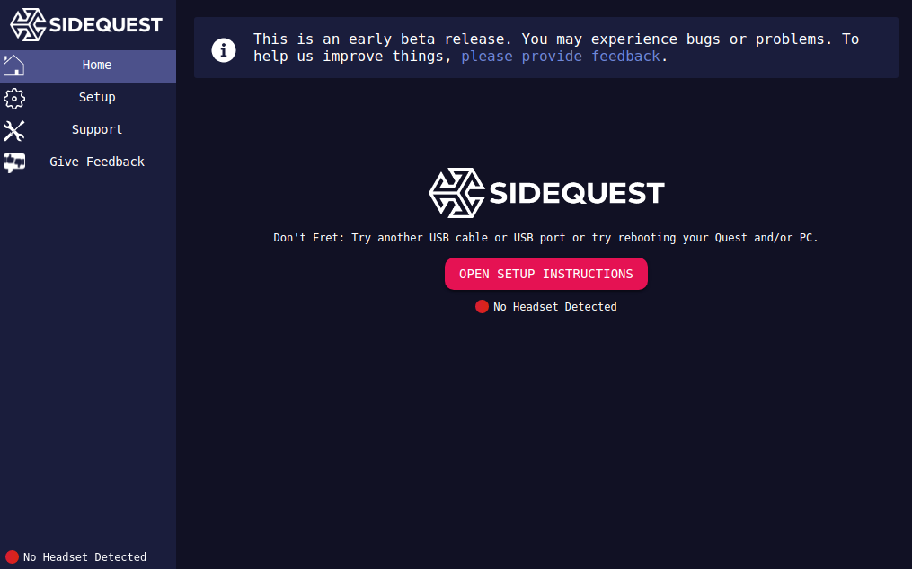
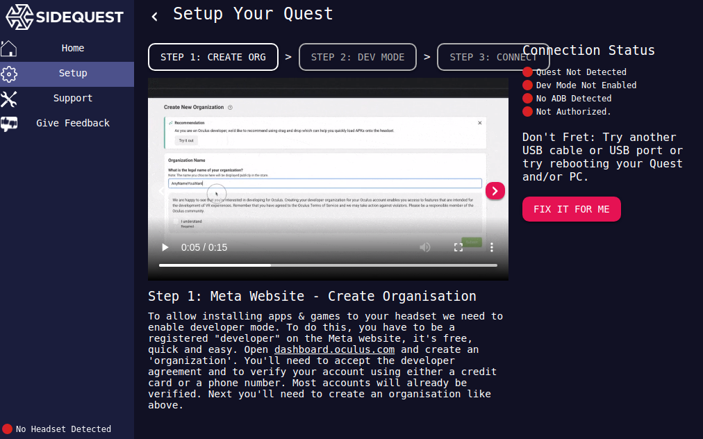
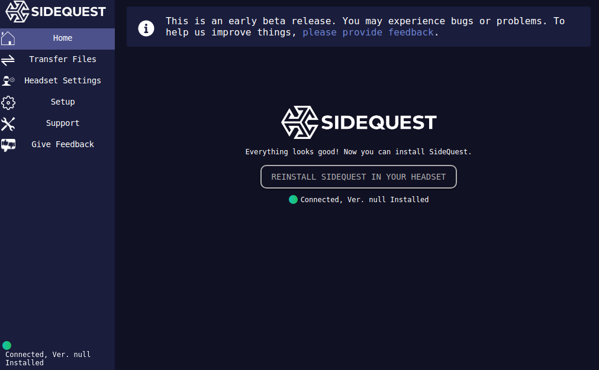

A few days ago I was finally able to setup my Linux computer and Oculus Quest 2
to play some Steam VR games wirelessly. It tooks me several attempts over
many months, and it was one of the most complicated process I had to discover
and follow. So I figured I would share a small step-by-step guide to help others.

Even though the process was painful for me at times, I would like to make it clear
that the ALVR and SideQuest teams and their community have nothing to do with that:
they are doing an *amazing job* and I'm very thankful for that.

<!--more-->

---

## Preparation

- I recommend doing this with a friend: you'll probably have to put
  the Quest 2 headset back and forth many times. It's easier if there's one
  person on the computer and another one wearing the headset.
  It's definitely doable alone though, just a bit more annoying.
- Make sure your headset and controllers are charged.
- Make sure your headset is up-to-date. Go to Settings, System, Updates,
and install any available updates.
- Make sure your headset is connected to WiFi, and that your computer
  is connected to the same network, preferably over a wired connection.
  The Wifi emitter should broadcast on the 5GHz range. I don't know if this is
  mandatory or if other ranges work too (2.4GHz, 6GHz, etc.). I suppose
  it's just a matter of performance.
- Get a good USB-C cable. Preferably a long one: if wireless doesn't work in the end,
  you will at least have a long cable to allow you to move more freely when playing.

At any step of the way, if something isn't working,
it's probably a good idea to reboot.

## Install SteamVR

This one is easy. Open Steam, search for SteamVR in the store, and install it.
It weighs 5GB so better start downloading now.


## Install some system packages

ALVR will need some packages to allow the connection from your Quest 2.

```bash
yay -S pipewire pipewire-alsa pipewire-pulse
```

The last two packages will replace `pulseaudio` and `pulseaudio-alsa`.
[PipeWire](https://wiki.archlinux.org/title/PipeWire) seems to be a modern
and promising solution, so I took the leap and replaced them. To make sure
audio was still working, I rebooted the computer and played some audio files,
as well as videos in the browser. All worked fine.

ALVR also offers to configure your firewall to add rules allowing the
Quest 2 client to connect. If you don't have a firewall like `ufw` installed,
it's alright, you don't need it. ALVR will tell you it couldn't configure
the firewall, but it shouldn't cause any issue: without a firewall the ports
used by ALVR will be open. If you still want to install a setup a firewall,
you can use `ufw`:

```bash
yay -S ufw
sudo ufw enable
```

*I think* you will also need to install [ADB](https://wiki.archlinux.org/title/Android_Debug_Bridge),
because if I understand correctly, the Oculus Quest 2 runs an Android system.
I'm not sure because I have done all this many months ago.

```bash
yay -S adb
```

## Install a Rust toolchain

ALVR will be installed from sources, and it's written in Rust,
so you'll need a Rust toolchain. Official guides recommend `rustup`:

```bash
yay -S rustup
rustup update
```

Make sure to run `rustup update` if you already had `rustup` installed:
compiling ALVR will require recent versions of `rustc`.

## Install ALVR

Now you can install ALVR:

```bash
yay -S alvr
```

WARNING: **It takes a lot of RAM!**
Compiling ALVR took **13GB of RAM** on my system.
Make sure to close all other programs on your computer before installing ALVR.
It can take quite some time too, even with a good CPU.

## Setup ALVR

TIP: **Plug the headset**
At this point, I recommend plugging the headset onto the computer
with the USB-C cable, and powering on the headset. I don't remember
exactly when, but you'll get system popups in the headset asking
you to allow USB data transfer, debug mode and other similar things.
Also, it will let you know early if the USB-C cable is good enough
for your headset to be detected by ALVR/SideQuest (months ago
my headset was not detected and it probably was because my USB-C
cable was not good enough).

You should now have an `alvr_dashboard` command on your system,
but before running it launch SteamVR once and close it.
Official guides say it's needed to initialize SteamVR's configuration.

Now run `alvr_dashboard`. It will run a setup wizard, asking you to:

- reset settings: click reset
- check your hardware: click next
- check software requirements: click download and set PipeWire audio (this should succeed!)
- configure hand gestures: click next
- configure firewall: click add firewall rules if you have a firewall, then click next
- read some information: click next

ALVR and your system should now be configured correctly.

On ALVR's **Connections** tab, you will see a warning that
"the streamer is not connected". Simply click the "Launch SteamVR" button
to run SteamVR from ALVR.



*In the screenshot you see that I already have a trusted client.
In your case, you shouldn't see any trusted client: don't worry, we will do that later.*

In the **Installation** tab, you'll see
a button to "register ALVR driver". It is supposed to configure SteamVR
so that launching it directly from Steam will also run ALVR alongside it.
It does not work for me, so I always first open ALVR and then launch SteamVR from it.



Once SteamVR is running, you should see a small window and icons
telling you that the headset is correctly detected:



## Install SideQuest

SideQuest will allow you to "sideload" (upload) files onto your Quest 2.
We will use it to sideload the SideQuest app on the headset.
Why isn't there a SideQuest app installable in the Meta Quest Store? I don't know.
Probably because the devs didn't have time or capacity to do that yet,
or because of policy reasons, like Meta not allowing it :shrug:

- Download the SideQuest "easy installer" here: https://sidequestvr.com/setup-howto.
- Go to your Downloads folder and extract the archive.
- Go into the extracted folder and run `./sidequestlite`.



SideQuest greets you with a button to open some setup instructions.
Click on it to watch a video showing you stop steps to follow:
enabling developer mode on the headset and installing ADB.



I did that months ago, so I don't remember if I had any issues (I think I didn't).
The only annoying thing is that I had a mess of Meta, Facebook, Oculus and email accounts,
and I had to ask support to merge my accounts. In these cases, support asks
for the headset and controllers unique identifiers, and I had to watch a video
on YouTube made by a random person to learn how to "open" the headset
because the official docs were very poor on how to do this.

Upon completing the setup, you will get popups in the headset asking you
to authorize the connection: allow it and if asked, always remember your choice.

Once you have completed the setup, the home tab of SideQuest should display
an "Install SideQuest in your headset" button. Click on it, wait a bit.
In my case, since it's already installed, it shows "Reinstall SideQuest".



Leave SideQuest opened on your compute, and head into the headset (pun intended).

## Install ALVR app in headset

In the headset, go to Applications, and filter with "unknown sources".
You should see the SideQuest app. If you don't, go back to SideQuest on the computer
and click on "Reinstall" or "Update". Do that until the app shows up in the headset.

Once the SideQuest app shows up in your "unknown sources" applications,
you can launch it, and close SideQuest on your computer.

The SideQuest app will ask you to register your headset by going to https://sdq.st/link
and entering the code displayed in your headset. I think you will need to create an account for that.
Once you entered the code, a popup in the headset will ask you to accept the connection. Accept it.

You should now be able to explore SideQuest's contents in your headset.
Search for ALVR and install it. Why isn't there an ALVR app directly in the Meta Quest Store?
I don't know, and it's probably because of the same reasons there isn't a SideQuest app either.

Once installed, run the ALVR app in your headset. It will ask you to "Trust" the client
on your computer, so go back to your computer, in the ALVR Dashboard, and click
"Trust" in the Connections tab. If everything was configured correctly,
the headset should now be linked and trusted. Back into the headset,
the ALVR app should now bring you to a virtual room, displaying a board
with all your Steam VR games.

## Play games

Now each time you want to play VR games wirelessly in your Quest 2 headset,
you'll have to:

- run `alvr_dashboard` on your computer
- launch SteamVR through it
- launch the ALVR app in your headset
- launch a Steam VR game from the virtual ALVR room

You might get some issues, like some games detecting wrong controllers,
preventing you to play, or audio not coming out of the headset.

For the controllers, it might be possible to change some settings
in SteamVR settings (click the menu icon in the small SteamVR window),
but for some reason the settings window is bugged
on my computer, so I can't configure anything there.

For the audio issue, you can easily open `pavucontrol` to output
audio on something else, like a sound system plugged on your computer.
I'm not sure yet how to fix it for good and have audio come out of the headset,
and even official guides say it's very experimental yet.

In any case, make sure to check out [ALVR's wiki](https://github.com/alvr-org/ALVR/wiki),
particularly any Troubleshooting page.

Happy VR!

## Further notes

I recently learned about [Steam Link](https://store.steampowered.com/app/353380/Steam_Link/).
I told myself: "amazing! finally something straightforward, I won't have to tinker
with third-party stuff!". I didn't even **wonder** if it would work on Linux,
because, you know, it works over the network so if I can install it both on the computer and the headset,
and Steam can run the game, then the OS doesn't matter, right?


Well no, it doesn't work on Linux :facepalm:
And I find this very surprising given [SteamOS](https://store.steampowered.com/steamos)
itself is based on Linux.

Or maybe it's only the Quest2 part that doesn't work?
I have no idea. I'll be happy to update the post if someone knows this :smile:

Anyway, I'll keep an eye on it!