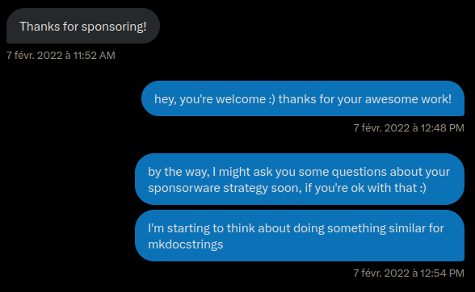
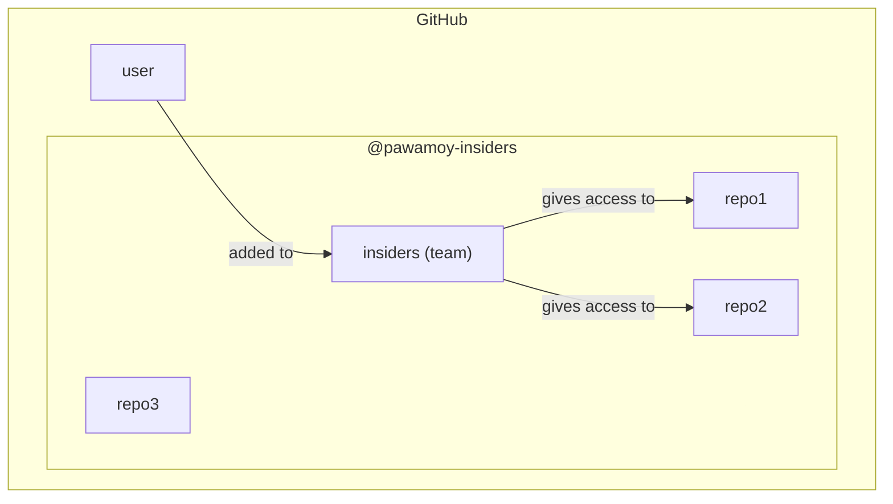
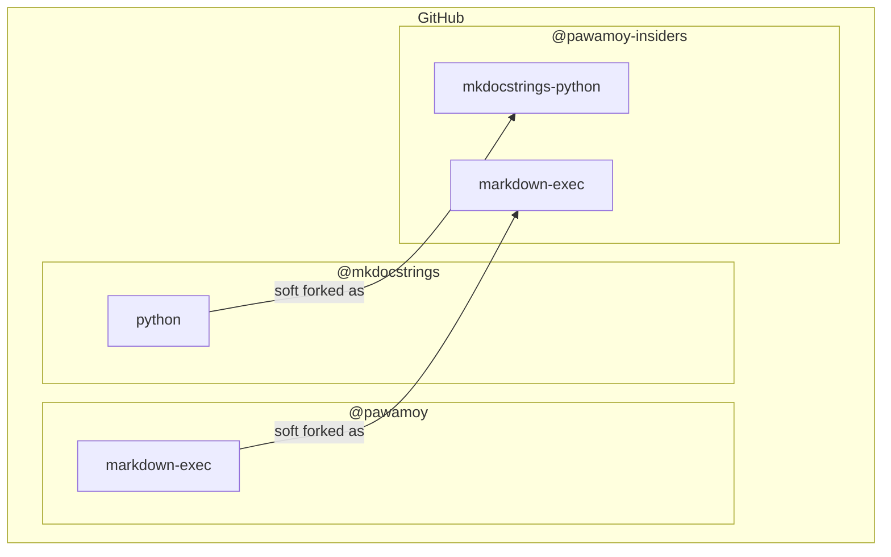
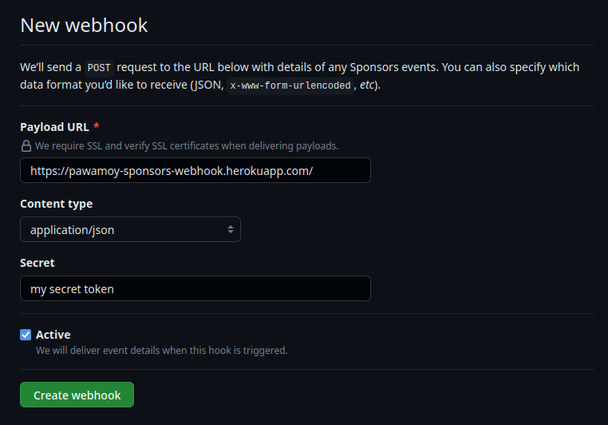
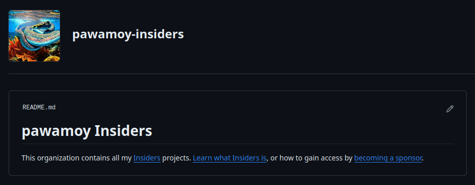
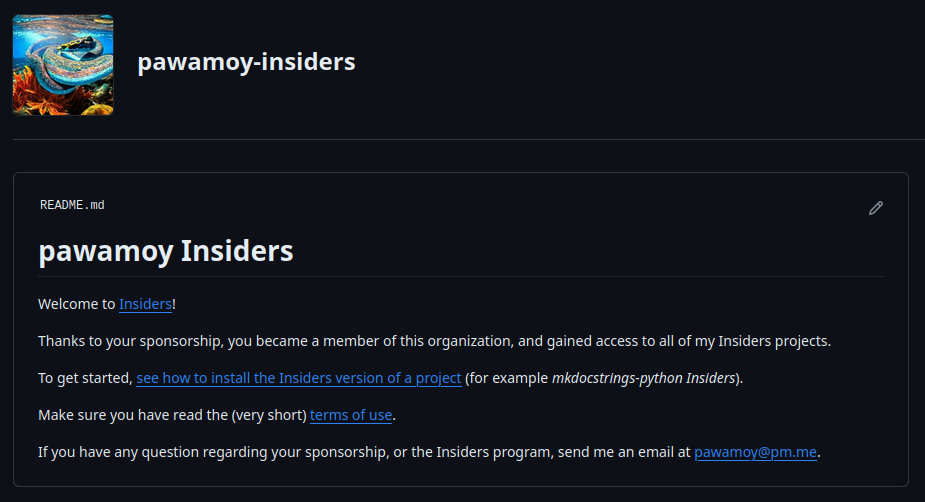
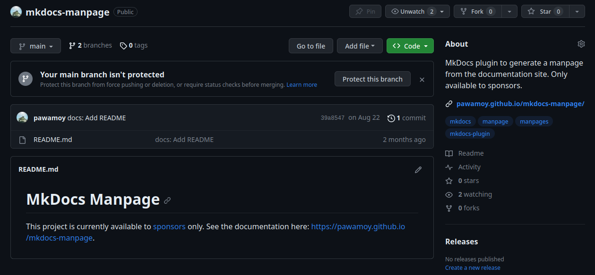

This post will embark you on my journey about making a living
off my open source projects. I'm still at the beginning of the journey,
but there is already a lot to say and I wanted to share my experience.
I like the idea of keeping a journal of what I go through,
and who knows, maybe it will help or inspire others.

In this post I write a bit about me, but I also provide
technical instructions on how to set things up.

<!--more-->

## A bit about me

I was born and live in France. Not that it's super important,
but it definitely played a role in my ability to become who I am today.

I went to university to learn computer science, for a total of six years
(should have been five if I studied more seriously). Each year cost around
400 euros to my parents. I lived at their place, and they paid for everything,
even during the last two years when I had a small income thanks to the apprenticeship.
Merci maman, merci papa :heart:

Once I got my master's degree, I was hired by the same people I did my apprenticeship with,
and worked two more years with them (so a total of four years).
This was my very first job as a developer. I was the only developer on my team, probably the only one on the whole site (hundreds of people).
I was working with researchers, building a website for families and professionals,
and had the "full-stack" hat on: Python, Django, Docker, Linux, PostgreSQL, HTML/CSS/JS,
Bootstrap, Highcharts, GitLab, to name a few tools and technologies.
A super interesting and fulfilling project, but hard.
I eventually burnt out from working alone without experience or guidance,
so decided to quit.

For a year, I worked on my open-source projects, still living at my parents' place.
It was great but I didn't have any income, and I knew that at some point
I would need to get a job if I wanted to leave the nest.
Lucky me, someone I knew offered me an interview at the company they worked for,
and just like that, I got a job that I didn't even search for.
My open-source work and experience helped: the people interviewing me
on the Python side of things were convinced of my skills just by looking at my projects on GitHub.
I stayed three years at this company (the length of the mission
at the client), discovered what it was to actually work with other developers
and engineers, made very good friends :beers: and eventually left for another project
at another company which offered a higher salary and four-day weeks.
I wanted to free some time to continue working on my open-source projects,
some of which had gained a lot more popularity (mkdocstrings).

After just three months at the new company, I quit again
because I couldn't stand working for someone else anymore,
on projects that didn't really interest me, thinking all the time
of my own projects while not being able to work on them.
I decided I would try to make a living thanks to my projects,
and this is where my journey begins :ship:

## The sponsorware strategy

For some time I had been following the progress of Martin Donath,
[@squidfunk](https://github.com/squidfunk) on GitHub,
and his [Material for MkDocs](https://squidfunk.github.io/mkdocs-material/) project.
Material for MkDocs is a framework for [MkDocs](https://www.mkdocs.org/) (a static site generator or SSG)
with awesome features and visuals. The project follows a "sponsorware strategy",
where Martin's sponsors get exclusive access to some nifty features.

I was amazed by how well it was working for Martin, and decided I would reach out
to him to ask a few questions. I wanted to try and start a similar strategy
for [mkdocstrings](https://mkdocstrings.github.io), an autodoc plugin for MkDocs.
Martin actually reached out first, to thank me for becoming his sponsor:

{ alt="Screenshot of Twitter messages. Him: Thanks for sponsoring! Me: hey, you're welcome :) thanks for your awesome work! by the way, I might ask you some questions about your sponsorware strategy soon, if you're ok with that :) I'm starting to think about doing something similar for mkdocstrings" }

This was the start of a conversation that continues to this day,
where Martin is extremely friendly and helpful, answering my questions,
providing me with advice, sharing his own experience. Vielen Dank Martin :bow:

Thanks to Martin I was able to start my own sponsorware strategy
when I felt ready for it, one year after the start of our conversation.
It's hard to quantify, but relying on a tried and proven model
probably saved me months of work, if not years, to get things right and rolling.

**So, what is this sponsorware strategy exactly?**

For the long, up-to-date explanations,
see [Material for MkDocs Insiders page](https://squidfunk.github.io/mkdocs-material/insiders/)
and [my own](https://pawamoy.github.io/insiders/).
You will notice (unless they changed drastically since the time of writing)
that my page is heavily (completely) based on Martin's, with his blessing.

For a shorter explanation: new features are available to sponsors only,
and when reaching a funding goal (in dollars per month), a specific set of features becomes free.
For example, when the maintainer(s) reach $1000/month,
features A, B and C become available to everyone (not just sponsors).
When they reach $2000/month, features D, E and F become available to everyone.
At the same time, funding from sponsorships actually helps developing
the aforementioned features, as well as the next ones.

I think we could call this a **win-win-win**: the maintainers are paid for their work
(and work on projects they like), the sponsors get early access to nice features
and ensure the growth (features) and reliability of the project (security/bug fixes),
and the rest of the community eventually gets those same features for free.

You could ask: *"If people sponsor you, why not releasing features to everyone immediately?"*
The answer is in the question: unfortunately, people, and especially companies,
seem to sponsor only if they are **incentivized** to do so.
Before I set up my sponsorware strategy, I had my GitHub sponsor profile active for two years,
and reached $35/month maximum, from individuals exclusively (no company).
The landscape is evolving, as well as the mentalities, but we're not there yet.
It seems few companies are willing to fund the open-source projects they use,
mainly because they are used to *pay in exchange of a service*.
If they can get this service for free, why paying?
And when paying, they want strong insurances, contracted support, etc., which
open-source maintainers cannot generally provide.
This is obviously a simplistic view, and the reality is more complicated,
but I wanted to emphasize that users and companies need incentive to fund your work,
and this incentive is achieved through sponsors-only features or contents.

To summarize:

- [x] a sponsorware strategy makes it possible for users and companies to fund your projects :material-hand-coin:
- [x] they get immediate access to projects or features that are available to sponsors only :octicons-unlock-24:
- [x] upon reaching funding goals, these features become available to everyone :fontawesome-solid-users:

## Platforms and tiers

There are many platforms that make it possible to get funding for open-source projects.
To name a few: [GitHub sponsors](https://github.com/sponsors) (integrated with [Stripe](https://stripe.com/en-fr)),
[Open Collective](https://opencollective.com/), [Ko-fi](https://ko-fi.com/), [Patreon](https://www.patreon.com/home),
[Liberapay](https://liberapay.com/), etc.

You are looking for one that allows to set up different tiers, with possibly different rewards.
For example, a $5/month tier that grants access to a single private repository,
and a $15/month tier that grants access to all your private repositories.
In my case, individuals get access to everything for $10/month,
and organizations get the same thing for $50/month.

It is recommended to set low/medium tiers for individuals,
and higher tiers for companies and organizations, as they have more funding power.
You can offer things like logo placement in your README
or documentation pages for organizations, as an incentive to select higher tiers.
Sometimes companies do not have budget for open-source funding,
but they do have budget for marketing, and logo placement is marketing,
so offering it can be the decisive factor for a company to sponsor you!
In my case I added $100/month and $200/month tiers, for Bronze :third_place:
and Silver :second_place: sponsors, offering higher logo placement in the docs,
and will probably add a Gold :first_place: tier later.
You can see how tiers look [on my GitHub sponsors page](https://github.com/sponsors/pawamoy/).

You are also looking for a platform that will allow automation, for example to grant access
to private repositories when new sponsorships are started.

You are not limited to a single platform: feel free to create accounts on multiple ones.
Initially, I created accounts on all these platforms, trying to maximize chances to get new sponsors.
That can work, but it represents a lot more work, as they don't all work the same way,
or provide the same APIs (JSON, GraphQL, webhooks, etc.). In the end, GitHub sponsors is my main driver,
because my private repositories are also hosted on GitHub (more on that in the next section),
making it super easy to automate granting/revoking access to/from users.
Since GitHub removed the integration with PayPal (which a lot of users rely on for sponsorship payments
because they don't have credit cards), I put my Ko-fi account back up for PayPal users, just in case.
Recently, [GitHub and Patreon started working together](https://github.blog/changelog/2023-10-03-sponsor-projects-through-patreon/),
so it might a good idea to have a Patreon account.
In August 2023, [Bloomberg gave $10,000 to MkDocs](https://github.com/mkdocs/mkdocs/discussions/3369),
and they used Open Collective to send the money, so my account there was also helpful (I received $1,000).

As long as the platforms you choose allow you to automate users access to your private repositories,
or at least to quickly react and manually add/remove users, it will cover 95% of your needs.

To summarize:

- [x] create an account on one or more platforms handling sponsorships :fontawesome-solid-handshake-simple:
- [x] set up multiple tiers (for individuals, for organizations) :material-podium:
- [x] add incentive to select higher tiers :material-target:
- [x] prepare for some automation work :material-pipe:

## Setting up an Insiders program

Once you and your projects are ready to follow a sponsorware strategy,
the next thing you can do is pick a name for the sponsors-exclusive projects or features.
I went with **Insiders** (*pawamoy Insiders*, *mkdocstrings Insiders*),
once again inspired by Martin's own program,
but you could use another common name like **Extras**, **Premium**, **Plus**,
or a fancier one like **Ultimate**, **Orichalcum** or **Diamond**.
For the rest of the post, I'll refer to "Insiders" or "Insiders projects".
You can also pick a theme for giving names to your funding goals.
For example Martin names them after chili peppers
([he's growing them on his balcony!](https://twitter.com/squidfunk/status/1305203481083604993)), like Piri Piri, Carolina Reaper, etc.
Most of my projects being documentation or development tools,
they make me think of the paper manuals you get when you buy
furniture, home appliance, or any kind of devices really,
so I went a "futuristic home appliance manuals" theme,
and asked ChatGPT to invent a few names for me :hear_no_evil:
GraviFridge User Manual, HyperLamp Quick Start Guide, etc.
Initially I wanted to use a "musical genre" theme,
like Brutal Black, Nintendo Chill, Clown Core :clown:,
or Lovecraftian Dark Ambient, but it felt both too vague and self-centered,
while not being related enough to my actual projects.

### Repositories

Each one of your project following the sponsorware strategy will exist
in two versions: the community version, available to everyone,
and the Insiders version, available to sponsors only.
That means two Git repositories per project.

Through my own Insiders program, sponsors get access to *all* my Insiders projects.
To facilitate granting access to all the repositories at once,
I created a dedicated organization on GitHub called `pawamoy-insiders`
(`pawamoy` is my username). Inside of that organization,
I created a team. This team serves as a bridge between projects and users
in the organization. It lets me choose which repositories users can access,
meaning I can still have completely private repositories in that organization,
that no one will see until I deem them ready.
Sponsors added to the team gain access to all of the team's repositories at once.



Each repository in the Insiders organization is a soft fork
of its corresponding public repository. By "soft fork" I mean
that new features implemented in the Insiders repository
eventually get merged back into the public repository.
The Insiders repository is not required to actually be a fork
in the GitHub sense (you can create it manually without
using the "Fork" button on the public repository),
nor to have the same name as the public repository.
Public repositories can be hosted in any other GitHub organization
or user account. For example in my case I have:



If your project already exists and you want to start developing insiders features,
all you have to do is create the insiders repository in your dedicated organization.
If you start a project from scratch, you have to create both the public and insiders repositories.

TIP: **Create and setup GitHub repositories with my `insiders` tool**
I created a tool called [`insiders`](https://pawamoy.github.io/insiders-project)
to help me manage my insiders projects. It is able to create public
and insiders repositories on GitHub, given you already have an insiders organization.
See the [CLI reference for creating projects](https://pawamoy.github.io/insiders-project/#create).
This project is available to sponsors only :wink: (see what I did here??)

You should also reserve a name on PyPI, for when the project becomes public.
This short script will do this for you (replace my name and email with yours!):

```bash title="reserve-pypi"
#!/usr/bin/env bash

cat <<EOF >/tmp/setup.py
from setuptools import setup

setup(
    name="$1",
    version="0.0.0",
    description="",
    long_description="",
    author="Timothée Mazzucotelli",
    author_email="pawamoy@pm.me",
    packages=[],
    classifiers=["Development Status :: 1 - Planning"],
)
EOF

cd /tmp || exit 1
rm -rf dist

# the following lines require setuptools, wheel and twine to be installed:
# python -m pip install -U setuptools wheel twine
python setup.py bdist_wheel
twine upload -r pypi dist/* --skip-existing
```

The script assumes you have a `~/.pypirc` file with the following contents:

```ini
[distutils]
index-servers =
    pypi

[pypi]
username: __token__
```

To authenticate against PyPI using a token, see
["How can I use API tokens to authenticate with PyPI?"](https://pypi.org/help/#apitoken)

TIP: **Register PyPI names with my `insiders` tool**
My [`insiders`](https://pawamoy.github.io/insiders-project) tool is able to register names on PyPI.
See the [CLI reference for registering PyPI names](https://pawamoy.github.io/insiders-project/#register).
Again, this project is available to sponsors only!

### Granting or revoking access

Ideally, we want to automatically grant access to the Insiders projects
when users start new sponsorships, and we want to revoke their access as soon
as they cancel it. Depending on the platform(s) you use to collect sponsorships,
you will have to query their API, react to their webhooks, or both.
I only automated access for GitHub Sponsors, so this is what I will show you,
but the approach is probably very similar for other platforms.

With GitHub Sponsors, you have a few different ways to automate access to your Insiders projects.
The easiest, but not the most efficient, is to create a cron job through GitHub Actions.
This cron job can run every 30 minutes for example. When a user starts a new sponsorship,
or update their current sponsorship to be eligible to the Insiders program,
they will have to wait at most 30 minutes to receive an invitation.
A more efficient way is to react to webhooks sent by GitHub: users will get the invitation
within a minute. But it's also a bit more complicated and requires more infrastructure setup.

Before anything, we need some code to grant and revoke access. I won't go into details,
but you can find [Python code in my sponsors repository](https://github.com/pawamoy/sponsors/blob/main/insiders.py)
that has everything we need. It expects to find a `TOKEN` environment variable,
which is a GitHub token with `admin:org` and `read:user` permissions.
When running it with `python insiders.py`, it will fetch all current members
of the configured organization team, all the pending invitations,
all the current sponsors, and grant or revoke access for each user
depending on their sponsorship.

#### GitHub Actions cron job

The action is relatively easy to configure:

```yaml
name: insiders

on:
  repository_dispatch:  # (1)!
  workflow_dispatch:  # (2)!
  schedule:  # (3)!
  - cron: '0 * * * *'

jobs:
  insiders:
    runs-on: ubuntu-latest
    steps:
    - name: Checkout
      uses: actions/checkout@v4
    - name: Set up Python
      uses: actions/setup-python@v4
      with:
        python-version: "3.10"
    - name: Install dependencies
      run: python -m pip install httpx
    - name: Grant/revoke access
      env:
        TOKEN: ${{ secrets.TOKEN }}  # (4)!
      run: python insiders.py
    - name: Commit changes
      run: |
        git config --global user.name "Timothée Mazzucotelli"
        git config --global user.email "pawamoy@users.noreply.github.com"
        if git commit -am "CI: Update JSON data"; then git push; fi
```

1. The `repository_dispatch` makes it possible to trigger the job with the GitHub API.
   This will be helpful if we want to react to webhooks sent by GitHub.
2. The `workflow_dispatch` makes it possible to manually trigger the job from GitHub's web interface.
   It can be useful if you want to quickly synchronize Insiders access with your latest sponsorship updates.
3. The actual cron scheduling. Here it says: "execute this at minute 0 of every hour".
4. The `TOKEN` secret can be set in the Security / Secrets and variables / Actions tab of your repository settings.

WARNING: **No pull request trigger!**
We must absolutely avoid running the worklow on pull requests,
otherwise anyone could grant oneself access to the Insiders organization
by adding their username in the Python script and opening a PR.
A push trigger would be secure enough though, as only the maintainers
of the repository holding the workflow can push to the main branch,
so you might want to add `push: [main]` to the `on:` list.

#### GitHub webhooks

GitHub allows to configure webhooks in your sponsors dashboard:

{ alt="GitHub form to create a sponsors webhook." }

When a user creates a new sponsorship, or cancels it, GitHub will send a payload
to the configured URLs. The idea here is to deploy a small service somewhere
(for example on Heroku, or as a server-less function in various cloud providers)
that will receive this payload and act on it. It could validate the payload,
making sure it comes from GitHub, before granting/revoking access for the user
specified in the payload, or it could simply trigger our workflow defined above
without any validation, since the workflow itself cannot be tempered with.

Triggering the workflow for each payload uses a bit more GitHub resources,
but it makes sure that no mistake can happen due to potential webhook race conditions.

For a working solution that simply triggers the workflow without payload validation,
take a look at [my sponsors webhook app](https://github.com/pawamoy/sponsors/blob/main/webhook.py)
(feel free to fork the entire repository, which also has Heroku configuration).
Upon receiving payloads, it will batch workflow triggers to avoid triggering
the workflow too many times in a row.

If you want to validate the payload in Python, you can use code like the following:

```python
import hmac
import hashlib
from fastapi import FastAPI, Request, HTTPException
from loguru import logger

# The webhook secret, configured when creating the webhook in your sponsors dashboard.
WEBHOOK_SECRET = os.getenv("WEBHOOK_SECRET")

app = FastAPI()


def is_valid_signature(secret: str, payload: bytes, their_hash: str):
    our_hash = hmac.new(secret.encode("utf8"), payload, hashlib.sha256).hexdigest()
    logger.debug(f"Our computed hash: {our_hash}")
    logger.debug(f"GitHub's hash: {their_hash}")
    return hmac.compare_digest(our_hash, their_hash.replace("sha256=", ""))


@app.post("/")
async def handle_webhook(request: Request):
    payload_data = await request.body()
    payload_hash = request.headers["X-Hub-Signature-256"]
    if not is_valid_signature(WEBHOOK_SECRET, payload_data, payload_hash):
        logger.error("Invalid payload hash")
        raise HTTPException(status_code=400, detail="Invalid payload hash.")
    ...  # grant/revoke access, or trigger the workflow
```

Once your GitHub action is cron-scheduled, and/or your service is up, 
everything is ready for you to start working on your Insiders features and projects!
Using a project template can be a good idea, as it makes it easy to create new projects
with all the boilerplate Insiders documentation and setup.
I myself use my own [Copier](https://github.com/copier-org/copier)
template, called [Copier PDM](https://pawamoy.github.io/copier-pdm),
which has support for Insiders setups.

To summarize:

- [x] create private repositories in an Insiders organization :octicons-organization-16:
- [x] automate access granting/revoking to your Insiders projects :material-boom-gate-arrow-up:
- [x] automate everything you can to help you kickstart new projects :material-bike-fast:

## Workflow

At this point, you should have a working infrastructure to offer access
to an Insiders program with projects and features exclusively available
to sponsors, with automatic granting/revoking of access.

Now lets talk about the workflow. At first sight it may seem simple:
just add features in the Insiders repositories. But quickly there are a lot
of questions that come to mind.

What if an Insiders feature needs a refactor in public parts of the code?
When I'm ready to release an Insiders version, how do I tag it?
How will users install the Insiders version if it's not on PyPI?
Should I have two documentation sites, one for the public project
and one for the Insiders project?
If I keep only one docs site, from which project do I deploy it, public or Insiders?
What if an Insiders project depends on another Insiders project? etc.

After a few months working on Insiders projects and features,
here is the workflow I developed, presented as a list of tips.

### Where to work?

Do the maximum amount of work in the public repository.
Any change (refactor, bug fix) that is not directly related to Insiders
should be done in the public repository and then only, pulled into the Insiders one.
I always define an `upstream` remote in my local Insiders repositories:

```bash
git remote add upstream git@github.com:pawamoy/project
```

...that I can pull from using:

```bash
git pull upstream main
```

Documentation should always be updated in the public repository,
even parts that are directly related to Insiders.

The less differences there are between your public and Insiders repositories,
the easier it will be to merge Insiders features back into the public repository
when funding goals are reached.
It represents more work, because of the potential back and forth between
commits pushed to the public repo, and pulled into the Insiders one,
but it maintains a more consistent code base. 
I like to see my public repositories
as the single sources of truth for my projects history: the Insiders
repositories are ephemeral and should eventually get completely
merged (or cherry-picked, or bluntly copied) into the public ones.

### Insiders compatibility?

If possible, your Insiders versions should always be compatible with the public ones.
By compatible, I mean that, in a project that depend on the Insiders version,
downgrading it to the equivalent public version should not cause any issue.
Ideally, public versions are aware of Insiders features, but these features are no-op.
At the very least, usage of Insiders features or configuration
while using a public version should not crash users' code.

If you follow the previous tip, and do most of the work in the public version,
keeping changes in the Insiders version to a minimum, it should help in maintaining
compatibility between public and Insiders versions.

### How to tag?

Tag your public releases normally (using semantic versioning or whatever suits you),
and prefix your Insiders tags with the public ones: if your latest public release
is version `1.2.3`, and your latest Insiders changes brought you to Insiders version `4.5.6`,
then tag your commit in the Insiders repository with `1.2.3.4.5.6`.
It means: Insiders 4.5.6 is based on the public version 1.2.3.

The benefit is that it makes it clear which public version an Insiders version is based on,
and the Insiders version is always a bit higher than the public one,
[PEP 440](https://peps.python.org/pep-0440/)-ly speaking,
so will take precedence over public versions during dependency resolution
(given it's available in a local index, see [How to install](#how-to-install)).

Some projects use [local version identifiers](https://peps.python.org/pep-0440/#local-version-identifiers)
to make the Insiders version more readable, like `1.2.3+4.5.6` or even `1.2.3+insiders-4.5.6`,
but for new projects I recommend against that, because local version identifiers
are not always accepted by PyPI-like registries. It means that sponsors who would like
to index your Insiders versions into their private registry,
for convenience within their infrastructure, wouldn't be able to.

### How to release?

To release public versions, I use a local
[`release`](https://pawamoy.github.io/copier-pdm/work/#releases) task from my machine.
There is nothing clever here, just use what suits you.

To release Insiders versions, I tag the latest commit and push both commit and tag:

```
git tag 1.2.3.4.5.6
git push
git push --tags
```

CI then automatically creates a GitHub release
(see [my templated CI job](https://github.com/pawamoy/copier-pdm/blob/main/project/.github/workflows/release.yml.jinja)).
The built distributions (source and wheel) are attached as artifacts to the GitHub release.

I recommend to always release a new Insiders version after a public release.
Example: if you were at version 1.2.2 and 1.2.2.4.0.0 for Insiders,
and just released 1.2.3, don't let Insiders behind at 1.2.2.4.0.0!
Pull upstream changes into your Insiders local repository,
and tag plus push a new Insiders version 1.2.3.4.0.0.

TIP: **Marketing again...**
I released the first version of a tool called [Devboard](https://pawamoy.github.io/devboard)
that will help me (and maybe you) keep track of this, and other Insiders-related things.
You guessed it: it's only available to sponsors :disguised_face:

To prevent mistakes like releasing an Insiders version to PyPI.org,
I recommend adding a check to any release script to make sure it aborts
with an error when ran in an Insiders project, whether it runs locally or in CI.

### How to deploy docs?

Since documenting Insiders features will often require these features
to actually be available, I recommend to always deploy docs from the Insiders project,
whether it is done locally or in CI.

To prevent mistakes like deploying from the public project, where the necessary
Insiders features are not available, I also recommend adding a check to any
deployment script, to make sure docs are never deployed from the public project.

### How to install?

Users with access to the private repositories can install Insiders versions with
`pip install git+ssh://git@github.com/...`, or `pip install git+https://${GH_TOKEN}@github.com/...`,
optionally passing Git references to the command, such as tags.

A disadvantage of installing from GitHub using SSH or HTTPS is that
this won't work for your contributors without access to Insiders.
One solution is to default to the public versions in your dependencies specification,
and override them with the Insiders ones in CI.

Another solution is to use my [PyPI Insiders](https://pawamoy.github.io/pypi-insiders/)
project (sponsors only :see_no_evil:), which lets you keep and update Insiders distributions
in a local package index (or in any other private index, self-hosted or not).
It lets you specify dependencies as if they were public, while tools will pick up
Insiders versions from your local index if there are any available.
Contributors without access will transparently get the public versions.

>? TIP: **Enough with the tips!**
> 

### How to run CI?

You should run your complete test matrix in the public project CI,
like you would normally do. Since they are private, Insiders repositories
will need to be more frugal, as we only have (at the time of writing)
**2000 CI minutes per month with GitHub's free plan**.
I exploded my 2000 minutes in a few days the first month, lesson learned.

To avoid too much repetition in my GitHub workflows,
I ended up with an additional job that will filter out some cells
of the test matrix when running in an Insiders repository.
See the `exclude-test-jobs` job in
[my CI workflow template](https://github.com/pawamoy/copier-pdm/blob/main/project/.github/workflows/ci.yml.jinja).
Basically, it detects if it runs in an Insiders repository,
and in that case outputs a JSON list of patterns
that is used by the next job to match and exclude test jobs.

## Communication

I am definitely not an expert in comms/marketing,
but here are some obvious tips on how to advertise your work.

Your Insiders organization can have both a
[public README](https://docs.github.com/en/organizations/collaborating-with-groups-in-organizations/customizing-your-organizations-profile#adding-a-public-organization-profile-readme)
and a
[member-only README](https://docs.github.com/en/organizations/collaborating-with-groups-in-organizations/customizing-your-organizations-profile#adding-a-member-only-organization-profile-readme).
You can use that to your advantage by telling about your Insiders program
in the public README, and giving useful tips and instructions to your sponsors
in the member-only README. For example, in the public README:

```md
# pawamoy Insiders

This organization contains all my [Insiders](https://pawamoy.github.io/insiders/) projects.
[Learn what Insiders is](https://pawamoy.github.io/insiders/#what-is-insiders),
or how to gain access by [becoming a sponsor](https://pawamoy.github.io/insiders/#how-to-become-a-sponsor).
```

{ alt="Screenshot of the public Insiders org profile." }

And in the member-only README:

```md
# pawamoy Insiders

Welcome to [Insiders](https://pawamoy.github.io/insiders/)!

Thanks to your sponsorship, you became a member of this organization,
and gained access to all of my Insiders projects.

To get started,
[see how to install the Insiders version of a project](https://mkdocstrings.github.io/python/insiders/installation/)
(for example *mkdocstrings-python Insiders*).

Make sure you have read the (very short) [terms of use](https://pawamoy.github.io/insiders/#terms).

If you have any question regarding your sponsorship, or the Insiders program,
send me an email at pawamoy@pm.me.
```

{ alt="Screenshot of the member-only Insiders org profile." }

The public repositories of your Insiders projects
(when the whole project is available to sponsors-only)
should have a README that explains this project is for sponsors only,
with links to your Insiders program documentation
as well as the project's documentation. For example:

```md
# Project Name

This project is currently available to [sponsors](https://github.com/sponsors/pawamoy) only.
See the documentation here: https://pawamoy.github.io/project-name.
```

You can also set up a GitHub description like:

```
Short description of the project. Only available to sponsors.
```

Here is how it looks (at the time of writing)
for my [MkDocs Manpage](https://github.com/pawamoy/mkdocs-manpage) project:

{ alt="Screenshot of the MkDocs Manpage project home page on GitHub." }

Automate GitHub Releases creation for both public and Insiders
repositories. GitHub users can subscribe to releases activity,
in their feed or through notifications. It makes your progress
and your project's evolution visible.

In your documentation, you can add a dismissable banner at the top
to let readers know that there is an Insiders version,
available to sponsors only. Each documented Insiders feature
should also clearly mention that it is available to sponsors only,
with a link to your Insiders program explanation.
Readers landing on your pages thanks to search engines probably
don't know anything about your motivations and why some features
are only available behind paywalls, so it is very important
to explain your strategy to them.
Your documentation is the main funnel to new sponsorships:
take good care of it!

Use the ["Sponsor" button feature](https://docs.github.com/en/repositories/managing-your-repositorys-settings-and-features/customizing-your-repository/displaying-a-sponsor-button-in-your-repository)
of GitHub: add a `.github/FUNDING.yml` file
in your repositories with contents like:

```yaml
github: your_username
ko_fi: your_username
custom:
- https://www.paypal.me/your_username
```

Don't be shy - sometimes users just want to say thank you with $20
and will prefer sending them quickly to you using a platform they already
have an account on. One-time donations are not what we are aiming at,
to build reliable funding for our project(s),
but they sure help and are very much appreciated.

Add links to your Insiders program and/or funding pages on your GitHub profile,
on your GitHub Sponsors profile, on your website, in your docs, in your blog posts.
**It is OK to advertise your work.** You deserve to get funding for your projects.
Don't spam though! People don't like spam. Try to stay authentic and humble.
You don't need to disguise yourself as someone you're not:
you just need to show that you care about your projects and about your users.

## Final note

A short summary.

Sponsorware strategies benefit both users and developers
while keeping your projects open-source.
There are a number of platforms allowing developers to set up
sponsorship accounts and tiers, to receive money and fund their open-source projects.
You don't need a fancy infrastructure to manage sponsors and private projects,
a GitHub organization and team work just fine.
Juggling between public projects and their private counterparts
necessitates a bit of discipline, and is made easier with good tooling.
Hopefully the whole sponsorware setup can be automated away one step at a time.

You may have noticed a few mentions to my Insiders project throughout this post :smirk:
I'm creating quite a number of those, and have many more ideas.
I would like to create a more unified experience around them,
for managing Insiders programs from start to finish.
For now, it's a lot of instructions and a bit of tooling/automation:
I'm working to provide more of the latter. So, stay tuned!
And if you start your own journey: good luck!

## Where I'm at

<style>
  /* The actual timeline (the vertical ruler) */
.timeline {
  position: relative;
  max-width: 1200px;
  margin: 0 auto;
}

/* The actual timeline (the vertical ruler) */
.timeline::after {
  content: '';
  position: absolute;
  width: 6px;
  background-color: var(--md-primary-fg-color);
  top: 0;
  bottom: 0;
  left: 50%;
  margin-left: -3px;
}

/* Container around content */
.timeline-container {
  padding: 10px 40px;
  position: relative;
  background-color: inherit;
  width: 50%;
}

/* The circles on the timeline */
.timeline-container::after {
  content: '';
  position: absolute;
  width: 25px;
  height: 25px;
  right: -13px;
  background-color: var(--md-primary-fg-color);
  border: 4px solid var(--md-accent-fg-color);
  top: 15px;
  border-radius: 50%;
  z-index: 1;
}

/* Place the container to the left */
.left {
  left: 0;
}

/* Place the container to the right */
.right {
  left: 50%;
}

/* Add arrows to the left container (pointing right) */
.left::before {
  content: " ";
  height: 0;
  position: absolute;
  top: 22px;
  width: 0;
  z-index: 1;
  right: 30px;
  border: medium solid var(--md-typeset-table-color);
  border-width: 10px 0 10px 10px;
  border-color: transparent transparent transparent var(--md-typeset-table-color);
}

/* Add arrows to the right container (pointing left) */
.right::before {
  content: " ";
  height: 0;
  position: absolute;
  top: 22px;
  width: 0;
  z-index: 1;
  left: 30px;
  border: medium solid var(--md-typeset-table-color);
  border-width: 10px 10px 10px 0;
  border-color: transparent var(--md-typeset-table-color) transparent transparent;
}

/* Fix the circle for containers on the right side */
.right::after {
  left: -13px;
}

/* The actual content */
.timeline-content {
  padding: 20px 30px;
  background-color: var(--md-typeset-table-color);
  position: relative;
  border-radius: 6px;
}

.timeline-content h2 {
  margin: 0 !important;
}

/* Media queries - Responsive timeline on screens less than 600px wide */
@media screen and (max-width: 600px) {
/* Place the timelime to the left */
  .timeline::after {
    left: 31px;
  }

/* Full-width containers */
  .timeline-container {
    width: 100%;
    padding-left: 70px;
    padding-right: 25px;
  }

/* Make sure that all arrows are pointing leftwards */
  .timeline-container::before {
    left: 60px;
    border: medium solid var(--md-typeset-table-color);
    border-width: 10px 10px 10px 0;
    border-color: transparent var(--md-typeset-table-color) transparent transparent;
  }

/* Make sure all circles are at the same spot */
  .left::after, .right::after {
    left: 15px;
  }

/* Make all right containers behave like the left ones */
  .right {
    left: 0%;
  }
}
</style>

In the very first paragraph of this post, I wrote about "keeping a journal".
I realise most of this post is more like a "how-to", so I'll reserve
this section for personal updates that you might find entertaining.

<div class="timeline">

```python exec="1"
def vibrate():
    return '<span class="twemoji new-feature vibrate"><svg xmlns="http://www.w3.org/2000/svg" viewBox="0 0 24 24"><path d="m23 12-2.44-2.78.34-3.68-3.61-.82-1.89-3.18L12 3 8.6 1.54 6.71 4.72l-3.61.81.34 3.68L1 12l2.44 2.78-.34 3.69 3.61.82 1.89 3.18L12 21l3.4 1.46 1.89-3.18 3.61-.82-.34-3.68L23 12m-10 5h-2v-2h2v2m0-4h-2V7h2v6Z"></path></svg></span>'


def left_right():
    while True:
        yield "left"
        yield "right"


def show_events(events: list[tuple[str, str]]):
    cycle = left_right()
    for title, paragraph in events:
        print(f'<div class="timeline-container {next(cycle)}">')
        print('<div class="timeline-content">')
        print(f"<h2>{title}</h2>")
        print(f"<p>{paragraph}</p>")
        print("</div></div>")


show_events(
    [
        (
          "June, 2019",
          'Creation of my <a href="https://github.com/sponsors/pawamoy">GitHub Sponsors profile</a> 😤',
        ),
        (
          "September-October, 2020",
          "First three sponsors: Chad Smith, Christoph Rieke, and Gunther Klessinger 💜",
        ),
        (
          "January, 2021",
          "First user trying to game the system 👹",
        ),
        (
          "October, 2021",
          "New sponsor.",
        ),
        (
          "February, 2022",
          "Beginning of a long preparation for my sponsorware strategy."),
        (
          "April-June, 2022",
          "Three new sponsors.",
        ),
        (
          "June, 2022",
          '<a href="https://github.blog/2022-06-24-thank-you-to-our-maintainers/">One-time donation of $550 from GitHub</a> 🎉'),
        (
          "September-November, 2022",
          "Two new sponsors.",
        ),
        (
          "December, 2022",
          "First sponsorship cancellation 😢.",
        ),
        (
          "January-March, 2023",
          "Finalization of my Insiders setup. Five new sponsors, two cancellations. "
          "I quit my job to work full-time on my projects.",
        ),
        (
          "April, 2023",
          f'{vibrate()} <b>New feature (markdown-exec):</b> <a href="https://pawamoy.github.io/markdown-exec/usage/pyodide">A Pyodide fence.</a><hr>'
          '<a href="https://github.com/mkdocstrings/mkdocstrings/discussions/550"><b>Official launch of my Insiders program 🚀</b></a><br>'
          '<a href="https://twitter.com/pydantic/status/1642893007107006464">One-time donation of $500 from Pydantic 🎊</a><br>'
          "Martin ups his sponsorship to $100, supporting the MkDocs ecosystem. "
          "Two new sponsors.",
        ),
        (
          "May, 2023",
          f'{vibrate()} <b>New feature (mkdocstrings-python):</b> <a href="https://mkdocstrings.github.io/python/usage/configuration/signatures/#signature_crossrefs">Cross-references for type annotations in signatures.</a><br>'
          f'{vibrate()} <b>New project:</b> <a href="https://mkdocstrings.github.io/griffe2md">griffe2md</a>, a tool to output API docs to Markdown using Griffe.<br>',
        ),
        (
          "June, 2023",
          f'{vibrate()} <b>New feature (mkdocstrings-python):</b> <a href="https://mkdocstrings.github.io/python/usage/configuration/headings/#show_symbol_type_toc">Symbol types in headings and table of contents.</a><br>'
          f'{vibrate()} <b>New project:</b> <a href="https://pawamoy.github.io/mkdocs-manpage">MkDocs Manpage</a>, a plugin to generate a manpage from the documentation site.<br>'
          f'{vibrate()} <b>New project:</b> <a href="https://pawamoy.github.io/pypi-insiders">PyPI Insiders</a>, a self-hosted PyPI server with automatic updates for Insiders versions of projects.<hr>'
          "First two sponsorships from organizations, Pydantic and Kolena. "
          "Two new sponsors, one cancellation.",
        ),
        (
          "July, 2023",
          f'{vibrate()} <b>New project:</b> <a href="https://mkdocstrings.github.io/griffe-pydantic">Griffe Pydantic</a>, a Griffe extension for Pydantic.<br>'
          f'{vibrate()} <b>New project:</b> <a href="https://mkdocstrings.github.io/griffe-typing-deprecated">Griffe Typing Deprecated</a>, a Griffe extension for <code>@typing.deprecated</code> (PEP 702).',
        ),
        (
          "August, 2023",
          f'{vibrate()} <b>New feature (mkdocstrings-python):</b> <a href="https://mkdocstrings.github.io/python/usage/configuration/members/#summary">Auto-summary of object members.</a><hr>'
          '<a href="https://github.com/mkdocs/mkdocs/discussions/3369">'
          "One-time donation of $10,000 to MkDocs, by Bloomberg</a> (I receive $1,000 🤸‍♂️). "
          "Two new sponsors, one cancellation.",
        ),
        (
          "September, 2023",
          f'{vibrate()} <b>New feature (mkdocstrings-python):</b> Automatic rendering of function signature overloads<br>'
          f'{vibrate()} <b>New project:</b> <a href="https://pawamoy.github.io/markdown-pycon">Markdown PyCon</a>, a Markdown extension to parse <code>pycon</code> code blocks without indentation or fences.<br>'
          f'{vibrate()} <b>New project:</b> <a href="https://mkdocstrings.github.io/griffe-tui">Griffe TUI</a>, a Textual user interface for Griffe.<br>'
          f'{vibrate()} <b>New project:</b> <a href="https://mkdocstrings.github.io/shell">mkdocstrings-shell</a>, a shell scripts/libraries handler for mkdocstrings.<hr>'
          "One-time donation of $1,000 by Sebastián Ramírez 🤯 "
          "Three new sponsors.",
        ),
        (
          "October, 2023",
          f'{vibrate()} <b>New project:</b> <a href="https://pawamoy.github.io/insiders-project">insiders</a>, a tool to manage your Insiders projects.<hr>'
          "<b>Creation of my company, a French micro-entreprise called <i>pawamoy-insiders</i>.</b> "
          "Four new sponsors (two orgs), one cancellation.",
        ),
        (
          "November, 2023",
          f'{vibrate()} <b>New project:</b> <a href="https://pawamoy.github.io/devboard">Devboard</a>, a development dashboard for your projects.<br>'
          f'{vibrate()} <b>New project:</b> <a href="https://mkdocstrings.github.io/griffe-inherited-docstrings">Griffe Inherited Docstrings</a>, a Griffe extension to inherit docstrings from parent classes.<hr>'
          "One new sponsor.",
        ),
        (
          "???",
          "French administration sends me my SIREN number (company number).",
        ),
        (
          "???",
          "I declare my taxes for the first time 👶",
        ),
    ]
)
```

</div>

## What's next?

In this post, I only described the technical aspects of a sponsorware strategy.
To truly make a living out of your projects, you also need to make it legal.
It is an entirely different beast to grapple with.

Once I am more comfortable with the administrative process in France
for *micro-entreprises*, I would like to add a second part to this post.
There is an awful lot of things to know when creating a *micro-entreprise*,
things that are almost impossible to learn by ourselves. I would like
to try and summarize the things I learned from professional counseilors.

In the meantime, I will keep updating this post with the things I learn
along the way :slight_smile:
