# copier-pdm

- Repository: https://github.com/pawamoy/copier-pdm
- Documentation: https://pawamoy.github.io/copier-pdm/

---

I was first introduced to project templating
with [CookieCutter](https://github.com/cookiecutter/cookiecutter)
and especially
the [cookiecutter-pylibrary](https://github.com/ionelmc/cookiecutter-pylibrary)
from [@ionelmc](https://github.com/ionelmc).
I learned many, many things about Python thanks to Ionel and his template,
discovering its features, design choices, opinions, and selected tools
during the years I worked with it.
I eventually forked it into my own
[cookiecutter-pydjama](https://github.com/pawamoy/cookiecutter-pydjama),
which was mostly designed to quickstart Django apps.
Then I slowly stopped using Django, and therefore stopped
maintaing my cookiecutter, which is now archived.

Back when I was still using cookiecutters,
one of the main challenges was to keep generated projects
up-to-date with the latest change in the upstream cookiecutters.
I'm always working on a lot of Python projects in parallel,
so without a way to keep each one of them tightly structured,
they all drift apart and it's hell to maintain them and
switch from one to another.

A solution to this, discussed on CookieCutter's issue tracker,
was to set up a `template` branch on the generated repositories,
branch that was dedicated to receiving templates updates.
These updates were then merged into the main branch,
so as to allow a bit of drifting from the template,
but still stay up-to-date.
It was implemented using a clever mix of git and bash commands.
And it was not perfect.

Then [cruft](https://github.com/cruft/cruft)
(by [@timothycrosley](https://github.com/timothycrosley))
made its appearance.
At that time I was not really using templates anymore, but was still lurking on
[cookiecutter#784](https://github.com/cookiecutter/cookiecutter/issues/784) and
[cookiecutter#1004](https://github.com/cookiecutter/cookiecutter/issues/1004)
to make sure I would not miss any great attempt at solving this problem.

Cruft is basically a wrapper around CookieCutter that brings this
updating functionality using some git magic.
Like a more robust and efficient version of my previous shell script.
I used it for some time, discovered some issues, sent one or two PRs.
But I was not really satisfied, and the project was not really active
(it is now, thanks to [@samj1912](https://github.com/samj1912) who
really improved it).

And then, *[Copier](https://github.com/copier-org/copier)* made its entrance.
A modest entrance. But a very interesting one.
In a few hours of checking it and testing it, I was hooked.
I took my old cookiecutter and started translating it to a Copier template,
opening issues with feedback in the process.
And it worked so well!
I used this opportunity to also update my tools stack,
trying out new bleeding-edge cool things to build the best
Python project template I could.

And this is how [copier-poetry](https://github.com/pawamoy/copier-poetry)
was born!

*Wait what? copier-**poetry**? not -**pdm**?*

Well yeah, before PDM,
I was using [Poetry](https://github.com/python-poetry/poetry)
(and am still using it).
Poetry simply revolutionized Python packaging and dependency management.
I'll let you see for yourself.
At some point though I discovered [PDM](https://github.com/pdm-project/pdm),
and it promised such great things!
The exceptional UX of Poetry, but more in touch with the new cool PEPs
around `pyproject.toml` and packaging, like (and I quote):

- [PEP 582](https://www.python.org/dev/peps/pep-0582/)
  local package installer and runner, no virtualenv involved at all.
- [PEP 621](https://www.python.org/dev/peps/pep-0621/) project metadata format.

And it reads `pip`'s configuration, which makes it so easier to integrate
in corporate environments! And it has *groups for development dependencies* :scream:

*(It's funny because [@sdispater](https://github.com/sdispater) and
[@frostming](https://github.com/frostming/), authors of Poetry and PDM,
seem to have worked together before!)*

I couldn't resist and duplicated *copier-poetry* into *copier-pdm*.
It's the same thing, but with PDM instead of Poetry.
If you are using *copier-poetry*, I'm sorry, all my love
will now go into *copier-pdm* and I likely won't update *copier-poetry* anymore :confused:
But I'll review your PRs of course!

To go back to Copier: Copier is a templating system and CLI tool
with the ability to generate projects from templates (using Jinja2)
and the ability to *update* them, which is *built-in*, when the template evolves!
Not being a wrapper around another tool allows it to have great features,
such as migrations, tasks, self-templating, multi-templating,
interactive prompts, and more!
At the time of writing, [@Yajo](https://github.com/Yajo)
has put and is putting a lot of work into improving Copier,
and I can't wait for v6!
