# duty

- Repository: https://github.com/pawamoy/duty
- Documentation: https://pawamoy.github.io/duty

---

A few years ago, when I was writing Django-apps, I was using [tox](https://tox.wiki/en/latest/)
to test my apps on multiple Django versions. I was happy with it, but found it a bit slow
when running jobs on a P*D-sized matrix (Python versions, Django versions).
Fortunately [detox](https://github.com/tox-dev/detox) was able to run tox envs in parallel.

At some point I stopped writing Django apps, and started searching an alternative
to tox with a lighter output, because I really don't like seeing *walls* of text
when a single line is enough (test passed? just print ok).

I started playing with [Invoke](https://www.pyinvoke.org/),
but quickly had issues with it,
notably [in Windows runs on GitHub](https://github.com/pyinvoke/invoke/issues/763).
I also felt limited in that I couldn't run Python code directly, only subprocesses.
I tried to implement such a feature in Invoke, but couldn't manage to do it.

I also played with [Nox](https://nox.thea.codes/en/stable/), but found it
too slow as well, even when reusing virtualenvs. And the console output was again
too heavy for my taste. Now that [PDM supports Nox](https://pdm.fming.dev/2.1/usage/advanced/#use-nox-as-the-runner),
I should definitely give it another try though!

In the end, I wrote my own task runner, [duty](https://github.com/pawamoy/duty), which is heavily inspired by Invoke.
duty is based on [failprint](https://github.com/pawamoy/failprint), an other project of mine that deals with running commands and capturing their output.
On top of that, duty adds the concept of tasks, task collections, and other helpful utilities, like callables for popular Python tools.
